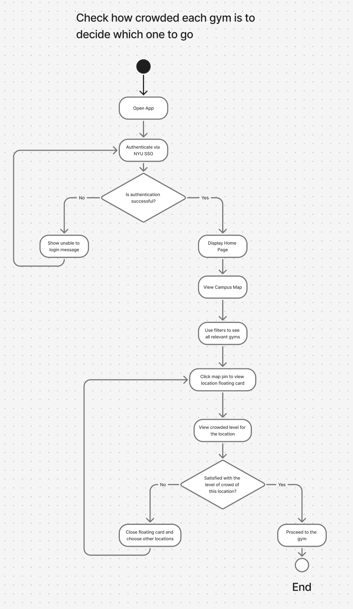
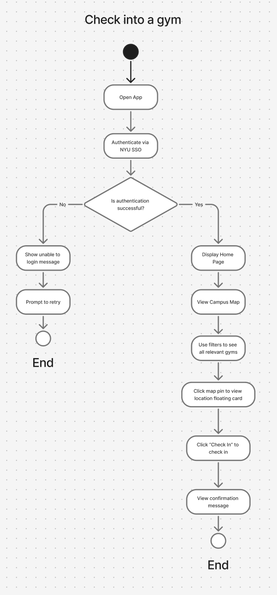
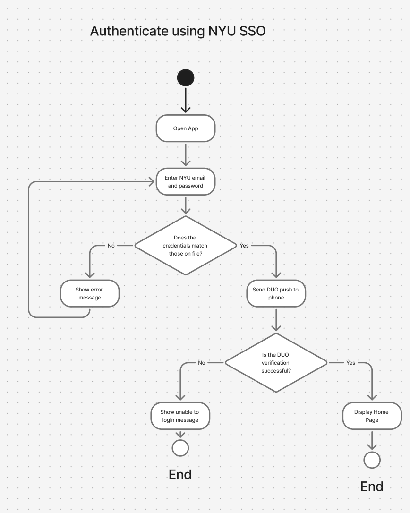

# Specification Phase Exercise

A little exercise to get started with the specification phase of the software development lifecycle. See the [instructions](instructions.md) for more detail.

## Team members

1. Vincent Campanaro, vac9827 - "https://github.com/vincentcamp"
2. Ermuun Bayartsaikhan, eb4500 - "https://github.com/ermuun0930"
3. Laura Liu, yl10127 - "https://github.com/lauraliu518"
4. Luke Sribhud, ls6540 - "https://github.com/lukeysan"
5. Alan Wu aw4630 - "https://github.com/aw4630"

## Stakeholders

**Stakeholder #1**: Isaac Tu (NYU student, goes to the gym a lot)

I interviewed my friend Isaac Tu about his experience using NYU gyms. He goes to the gym around 4–5 times a week, mostly 404, sometimes Palladium.

He was saying that the gym is always way busier than he expects, especially at night around 7-8 PM. A lot of the time every bench or squat rack is taken, so his workout ends up being 90 minutes long when it could really be 60 minutes long. Sometimes, he has to cut the workout short because he has something else to do after the gym. He said it’s really annoying when you’re already tired and just want to get a quick workout in.

He also mentioned that there’s no good way to know how busy a gym is beforehand. Sometimes he checks Google Maps, but it’s not accurate and doesn’t really reflect what’s going on inside the gym. He said if there was an app that showed real-time busyness, he’d actually use it before deciding which gym to go to. He also is interested in the social aspect of the gym and thinks it would be cool to be able to see which friends are in the gym at any time.

## Product Vision Statement

The vision for this product is to create a mobile app for NYU students that helps them decide when and where to work out by showing how busy each NYU gym is in real time. By using check-ins and check-outs and filters, the app keeps gym busyness and other infomation accurate so students find the gym that best sort their needs. The goal is to make going to the gym more efficient, accessible, and motivating for NYU students.

## User Requirements

1. As a student, I want to see how busy each NYU gym is, so I can decide which gym to go to.

2. As a student, I want to check in when I enter a gym and check out when I leave, so my gym usage is recorded and gym busyness stays accurate.

3. As a student, I want to log in using NYU SSO so I feel safe.

4. As a student, I want to control who can view my check-in information, so that I feel safe on the app.

5. As a student, I want to delete my account, so that I can leave the platform.

6. As a student, I want to quickly find currently open gyms of my interest so I can work out when I want to.

7. As a student, I want to see who is currently checked in at a gym, so I can know how busy it is and who is there.

8. As a student, I want to see how long I worked out, so I can track my gym activity.

9. As a student, I want to use this mobile app to motivate myself more and engage more with the NYU gym rats!

10. As a student, I want to view the address of gyms so I know where they are located.

## Activity Diagrams

User Story 1: As a student, I want to see how busy each NYU gym is, so I can decide which gym to go to.

User Story 2: As a student, I want to check in when I enter a gym and check out when I leave, so my gym usage is recorded and gym busyness stays accurate.

User Story 3: As a student, I want to log in using NYU SSO so I feel safe.

## Clickable Prototype

https://www.figma.com/design/lNsnbB75c69poEKuYRvzVL/Waffles---Wireframes?node-id=22-864&t=qWbTmDmho1jzPxDO-0
